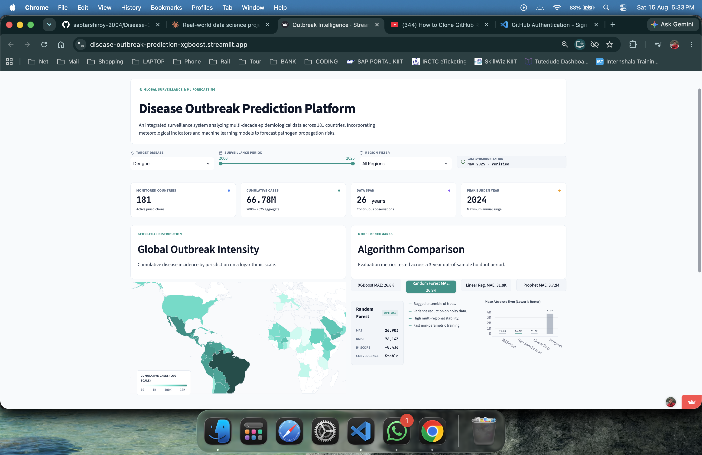
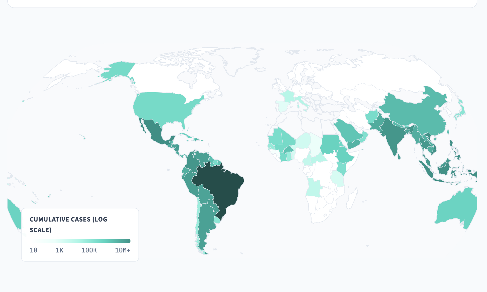
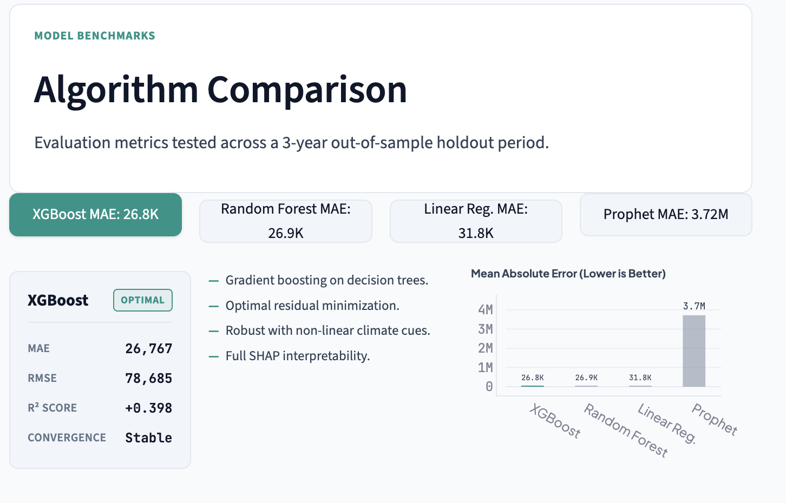
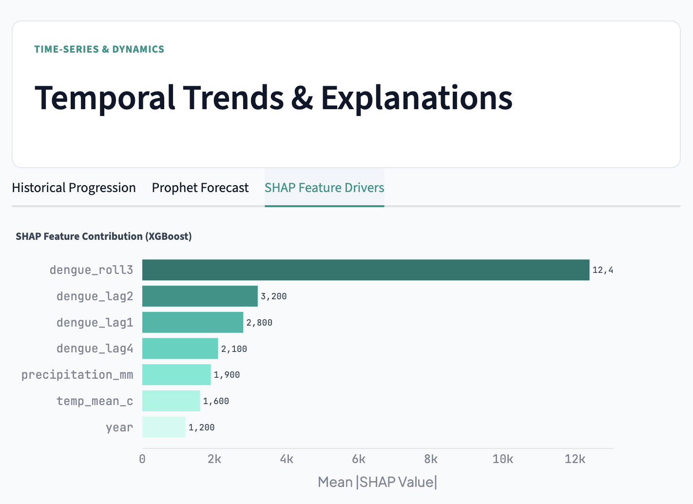

<div align="center">

# 🌍 Disease Outbreak Prediction

### ML-powered forecasting system for Dengue & Cholera outbreaks across 120+ countries

[](https://disease-outbreak-prediction-xgboost.streamlit.app)
[](https://python.org)
[](https://xgboost.readthedocs.io)
[](https://www.who.int/data/gho)
[](LICENSE)

<br/>

> Trained 4 ML models on real WHO data · Found & fixed a data leakage bug · Deployed with SHAP explainability

</div>

---

## 📸 Screenshots

> **Add your screenshots here** — follow the steps at the bottom of this README

| Dashboard (Light Mode) | Global Disease Map |
|:---:|:---:|
|  |  |

| Model Comparison Panel | SHAP Feature Importance |
|:---:|:---:|
|  |  |

---

## 🎯 What This Project Does

This system predicts **Dengue Fever** and **Cholera** outbreak risk across **120+ countries** using:
- Historical case data from the **WHO Global Health Observatory API**
- Climate features — **temperature** and **rainfall** — from Open-Meteo
- Engineered time-series lag features (1-year, 2-year, 4-year lags + rolling averages)

The final model forecasts case counts per country and flags high-risk regions on an **interactive world map**.

---

## 📊 Model Results

| Model | MAE (cases) | RMSE | R² Score | Notes |
|---|---|---|---|---|
| **XGBoost** ✅ | **26,767** | 78,685 | 0.398 | Chosen — best MAE + SHAP support |
| Random Forest | 26,903 | 76,143 | 0.436 | Close second |
| Linear Regression | 31,797 | 83,627 | 0.320 | Worst MAE |
| Prophet (Global) | 3,720,210 | 5,503,792 | -0.618 | Evaluated on global aggregates* |

> *Prophet was evaluated on global totals (millions) vs country-level for other models — not a direct comparison. Prophet is best used for per-country trend direction.

---

## 🐛 Data Leakage Bug — Found & Fixed

During model comparison, Linear Regression scored a suspicious **R² = 1.0**. Investigation revealed that the `dengue_roll3` feature (3-year rolling mean) was including the **current year's** case count — so the model was cheating by seeing the answer in the input.

```python
# ❌ WRONG — leaks current year into the feature
df['dengue_roll3'] = df.groupby('country_code')['dengue_cases'] \
    .transform(lambda x: x.rolling(3).mean())

# ✅ FIXED — .shift(1) ensures only past years t-1, t-2, t-3 are used
df['dengue_roll3'] = df.groupby('country_code')['dengue_cases'] \
    .transform(lambda x: x.rolling(3).mean().shift(1))
```

After the fix, Linear Regression dropped to a realistic R² = 0.32, and the pipeline was re-run end-to-end.

---

## 🧠 Why Temperature & Rainfall?

Both diseases are environmentally driven:

**Dengue** — Mosquitoes (*Aedes aegypti*) breed faster above **26°C** and need stagnant water from rainfall to lay eggs. Higher temperature = shorter incubation = more transmission.

**Cholera** — Heavy rainfall contaminates drinking water with *V. cholerae*. Flooding overwhelms sanitation infrastructure, causing outbreak spikes.

Our SHAP analysis **independently confirmed** these biological mechanisms from 20+ years of WHO data — rainfall and temperature ranked 5th and 6th among 7 features.

---

## ⚙️ Tech Stack

| Layer | Tools |
|---|---|
| **Data Collection** | WHO GHO REST API, OpenDengue GitHub, Open-Meteo API |
| **Data Processing** | Python, pandas, numpy, pycountry |
| **Modelling** | scikit-learn, XGBoost, Prophet (Meta) |
| **Explainability** | SHAP |
| **Geospatial** | geopandas, Folium |
| **Dashboard** | Streamlit, Plotly |
| **Deployment** | Streamlit Cloud, GitHub |

---

## 📁 Project Structure

```
Disease-Outbreak-Prediction/
│
├── data/
│   ├── raw/                  ← WHO cholera CSV, OpenDengue global CSV, climate data
│   └── processed/            ← master_disease_data.csv, model_ready_dataset.csv
│                               model_comparison.csv, prophet_forecasts.csv
│
├── notebooks/
│   └── 01-eda-base-map.ipynb ← EDA, charts, base Folium map
│
├── src/
│   ├── data/
│   │   ├── fetch_disease_data.py    ← WHO API + OpenDengue fetch
│   │   ├── fetch_climate_data.py    ← Open-Meteo climate fetch
│   │   ├── clean_data.py            ← cleaning + decoding pipeline
│   │   ├── fix_nans.py              ← country name + region imputation
│   │   ├── merge_data.py            ← merge disease + climate datasets
│   │   └── feature_engineering.py  ← lag features, rolling means (leakage-proof)
│   │
│   ├── models/
│   │   ├── train_prophet.py         ← Prophet baseline training
│   │   ├── train_xgboost.py         ← XGBoost training + SHAP
│   │   └── train_all_models.py      ← 4-model comparison pipeline
│   │
│   └── app/
│       └── streamlit_app.py         ← full dashboard with dark/light mode
│
├── reports/
│   └── figures/                     ← dengue_forecast.png, cholera_forecast.png
│                                      shap_feature_importance.png
│
├── requirements.txt
└── README.md
```

---

## 🚀 Run Locally

```bash
# 1. Clone the repo
git clone https://github.com/saptarshiroy-2004/Disease-Outbreak-Prediction.git
cd Disease-Outbreak-Prediction

# 2. Create virtual environment
python3 -m venv venv
source venv/bin/activate        # Mac/Linux
# venv\Scripts\activate         # Windows

# 3. Install dependencies
pip install -r requirements.txt

# 4. Fetch data (run in order)
python src/data/fetch_disease_data.py
python src/data/fetch_climate_data.py
python src/data/clean_data.py
python src/data/fix_nans.py
python src/data/merge_data.py
python src/data/feature_engineering.py

# 5. Train models
python src/models/train_all_models.py

# 6. Run the dashboard
streamlit run src/app/streamlit_app.py
```

Open `http://localhost:8501` in your browser.

---

## 📦 Requirements

```
streamlit
streamlit-folium
pandas
numpy
scikit-learn
xgboost
prophet
shap
folium
plotly
geopandas
pycountry
requests
matplotlib
seaborn
```

---

## 🗂️ Data Sources

| Source | Disease | Coverage | Link |
|---|---|---|---|
| WHO GHO API | Cholera | Global (all countries) | [who.int/data/gho](https://www.who.int/data/gho) |
| OpenDengue Project | Dengue | 102 countries | [opendengue.org](https://opendengue.org) |
| Open-Meteo API | Climate (temp + rain) | Global | [open-meteo.com](https://open-meteo.com) |
| Natural Earth | Shapefiles | World polygons | [naturalearthdata.com](https://naturalearthdata.com) |

---

## 📌 How to Add Screenshots

1. Take screenshots of your live app at `disease-outbreak-prediction-xgboost.streamlit.app`
2. Create a folder `assets/screenshots/` in your repo
3. Save these 4 screenshots:
   - `dashboard_light.png` — full dashboard in light mode
   - `map.png` — the world map zoomed out
   - `model_comparison.png` — the 4-model selector panel
   - `shap.png` — the SHAP importance chart tab
4. Commit and push:
```bash
git add assets/
git commit -m "Add dashboard screenshots"
git push
```
The images will automatically appear in this README.

---

## 👤 Author

**Saptarshi Roy**
- 🔗 [LinkedIn](https://www.linkedin.com/in/saptarshiroy2004)
- 💻 [GitHub](https://github.com/saptarshiroy-2004)
- 🌐 [Live Demo](https://disease-outbreak-prediction-xgboost.streamlit.app)

---

<div align="center">

**If this project helped you, give it a ⭐ on GitHub!**

</div>